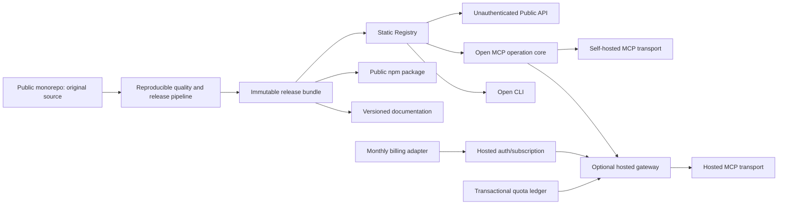
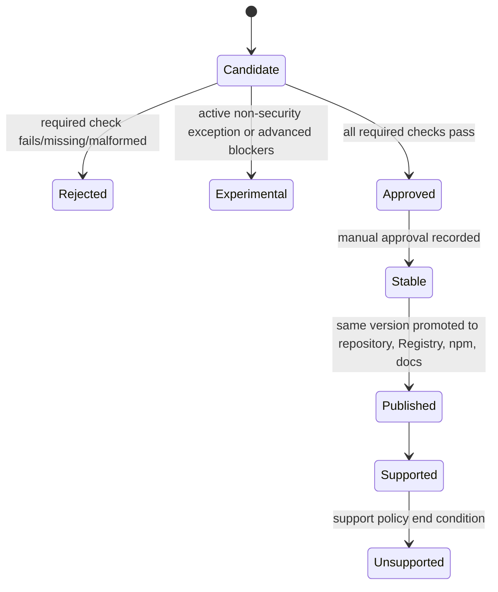
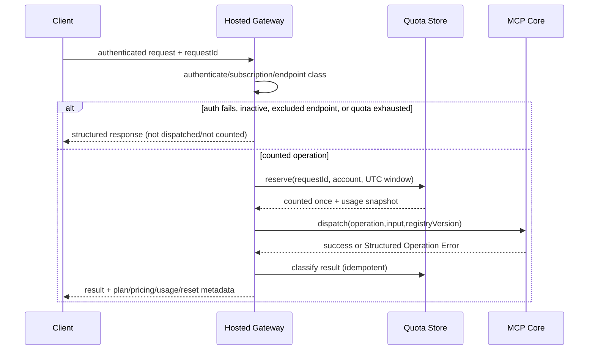

# Technical Design: NeuraForge Open-Source UI

## Overview

NeuraForge UI is designed as an open-source, release-oriented monorepo whose canonical output is an immutable, signed-off release bundle. The bundle contains original React/Tailwind source, schemas, Registry metadata, documentation, checksums, provenance, quality evidence, and deployment material. Public Registry, Public API, CLI, npm, MCP, documentation, and self-hosted surfaces must all resolve the same exact artifact version from this bundle rather than maintaining independent mutable catalogs.

`requirements.md` is authoritative. The supporting [startup plan](../../../NeuraForge-Startup-Plan.md) and [UI Pro addendum](../../../NeuraForge-UI-Pro-Addendum.md) inform React/Tailwind selection, MCP-first discovery, curated-before-generative composition, and incremental delivery. Their proposals for paid/private artifacts, proprietary paid fonts, premium MCP capabilities, self-hosting entitlements, and a general blog conflict with Requirements 1, 14, 17, and 18 and are intentionally excluded. Hosted plans sell only managed request capacity and administration; every released artifact and operation remains public and self-hostable.

### Goals

- Ship a 15–20 component MVP covering all six categories, with tokens, Registry, npm, CLI, discovery MCP operations, docs, contribution workflows, and reproducible gates.
- Keep source ownership, artifact provenance, deterministic retrieval, accessible behavior, and cross-channel checksum parity as architectural invariants.
- Make public and self-hosted operation independent of NeuraForge accounts and services.
- Add motion, 3D, and curated compositions incrementally as public, open capabilities after their specific evidence gates pass.
- Place hosted authentication, quota accounting, billing lifecycle, and organization administration outside the open MCP operation core.

### Non-goals

- A general-purpose or multi-author blog, feeds, memberships, comments, or article monetization.
- Paid/private artifacts, exclusive themes/fonts/components, private MCP operations, or license-key-gated self-hosting.
- Unconstrained generative layout in the MVP; later composition begins with deterministic curated manifests.
- Server-side modification of an agent caller’s project; MCP only returns verified data and plans.

### Research findings and design consequences

1. The requirements demand exact cross-channel parity and immutable supported releases; therefore releases are content-addressed snapshots, and all adapters use a shared catalog reader and canonical-byte algorithm.
2. The plans correctly recommend a focused React/Tailwind MVP and curated composition before open-ended generation; these are retained as sequencing guidance only.
3. Hosted quota semantics require concurrency-safe exactly-once accounting at dispatch. A transactional usage ledger with a unique request identifier is the system of record; caches may accelerate reads but never decide billing truth.
4. Privacy rules prohibit request payloads, source, prompts, paths, brand values, and credentials in quota or telemetry records. The hosted gateway records only the enumerated quota fields, while telemetry is a separate default-off subsystem.
5. Stable status is evidence-derived, not editorial: missing, failed, malformed, or excepted checks prevent stable classification. Advanced artifacts may remain public but must be marked experimental with blockers.

## Architecture

### Architectural style

The system uses a functional core with adapter boundaries. Pure packages validate schemas, canonicalize artifacts, calculate checksums, resolve versions, rank candidates, generate themes, build install plans, and evaluate release policy. I/O adapters expose these functions through static Registry files, HTTP Public API, MCP transports, CLI, npm packages, documentation builds, CI, and the optional hosted gateway.
### Logical architecture



The immutable bundle is the sole publication boundary. The Public API is a read-only adapter over released Registry snapshots. The CLI computes local plans and applies them only after explicit confirmation. The MCP core has no project filesystem write capability. The hosted gateway authenticates, checks subscriptions and quotas, reserves exactly one counted call, then invokes the same operation dispatcher used by self-hosting.

### Monorepo boundaries

| Boundary | Responsibility | May depend on | Must not depend on |
|---|---|---|---|
| `packages/schemas` | Versioned JSON Schemas and generated types | none | network, UI runtime |
| `packages/catalog-core` | Validation, canonical bytes, checksum, version resolution, pagination, ranking | schemas | transport, hosted billing |
| `packages/tokens` | Token import/export, reference validation, Tailwind theme generation | schemas, catalog-core | hosted services |
| `packages/components` | Editable React/Tailwind source and examples | public compatible dependencies | Registry network at runtime |
| `packages/motion` | Later Framer Motion presets and validation | schemas, exact Framer Motion peer | hosted services |
| `packages/three-d` | Later 3D components and fallbacks | schemas, exact compatible 3D peers | hosted services |
| `packages/compositions` | Later curated manifests, invariant validation, deterministic selection | schemas, catalog-core | required model provider |
| `packages/registry-builder` | Build immutable Registry and release manifests | all artifact packages | hosted account data |
| `packages/cli` | Search/inspect/preview/apply/rollback using verified snapshots | catalog-core | hosted entitlement |
| `packages/mcp-core` | Public operation schemas and side-effect-free dispatch | catalog-core, tokens, compositions | billing/auth/quota |
| `apps/docs` | Versioned docs, examples, search index | Registry snapshots | login/paywall |
| `services/public-api` | Unauthenticated exact-version reads | Registry storage | hosted subscription |
| `services/hosted-gateway` | Auth, subscription lifecycle, quota reservation, response usage metadata | mcp-core, hosted stores | artifact-tier authorization |
| `packages/conformance` | Shared public/self-hosted operation cases | public contracts | environment-specific behavior |
| `packages/release-policy` | Gate aggregation, stable/experimental decision, SemVer policy | schemas | manual bypass of security gates |

### Release topology and lifecycle



1. Source commits pin production and quality-tool versions and contain provenance records.
2. The builder validates all metadata references, schemas, compatibility, licenses, source paths, docs, checksums, and evidence.
3. Canonical bytes are UTF-8, paths use `/`, line endings are LF, JSON object keys are recursively lexicographically sorted, insignificant JSON whitespace is removed, file entries are sorted by normalized path, and file bytes are length-delimited. SHA-256 is the MVP checksum algorithm; the algorithm identifier is stored with every digest.
4. Quality results are generated per check. Any required failure or absent/malformed result rejects stable publication. A time-limited non-security exception yields only an experimental prerelease. Security exceptions remain private while risky but still cannot produce stable status.
5. After all gates pass, a maintainer records manual approval. Promotion copies one already-built bundle; it never rebuilds per channel.
6. Supported bundle bytes and metadata are immutable. Corrections require a new SemVer release and migration metadata where applicable.

MVP publication includes only core components and required surfaces. Motion, animated components, 3D, and compositions use separate packages and Registry kinds so they can enter later releases without changing MVP contracts. Curated composition selection precedes any generative provider adapter; generative output can never bypass manifest validation or provenance.

### Deployment topology

**Public project topology:** static versioned Registry and documentation assets can be served by any object store/CDN; the Public API provides read-only content negotiation and pagination; npm serves package tarballs. These surfaces require no account.

**Self-hosted topology:** one release bundle supports either a single-process deployment (Registry static server + Public API + MCP HTTP/stdio + docs) or separately scaled containers. Local filesystem or S3-compatible storage is selected through validated configuration. Egress is disabled by default and is unnecessary after image/bundle acquisition. Operators control endpoints, credentials, retention, MCP limits, backup storage, and TLS termination. Health reports version/schema/interface status without secrets.

**Hosted MCP topology:** an edge/API gateway terminates TLS, authenticates the account, rejects inactive subscriptions, classifies excluded endpoints, performs transactional quota reservation, and dispatches to stateless MCP workers. PostgreSQL (or an equivalent ACID store) owns subscriptions, immutable pricing versions, billing cycles, request ledger, and daily counters. A payment provider is an replaceable adapter; payment webhooks update billing state idempotently but never grant artifact capabilities. Registry snapshots remain read-only and shared with public/self-hosted deployments.

### Trust boundaries and security posture

- Untrusted boundaries: contributor input, Registry downloads, CLI target projects, Brand Config, MCP input, hosted identities/webhooks, release dependencies/assets, and generated docs examples.
- Every boundary validates against a versioned schema; unknown fields are rejected where contracts require closed input.
- Artifact authenticity uses published checksums over canonical bytes; CLI and MCP reject unverifiable content before presentation/application.
- Release CI uses least privilege, pinned actions/tools, protected approvals, secret scanning, dependency/license/vulnerability scanning, package-content inspection, and reproducible build evidence.
- MCP retrieval is read-only. CLI writes are confined to an explicit plan, conflict policy, journal, and rollback transaction.
- Hosted authorization is account/organization scoped only for operational access and administration; no plan can authorize otherwise-hidden artifacts or operations.
- Logs use allowlists and redaction. Quota records and telemetry are physically/logically separated, with telemetry disabled by default.
- Private vulnerability/conduct records have restricted roles and documented retention; public records preserve corrections rather than rewriting history.

## Components and Interfaces

### Artifact authoring and Registry builder

Each artifact directory contains editable source, metadata, examples, tests, docs references, and optional generated files. The builder resolves all exact versions, verifies that referenced files exist, detects unresolved license or compatibility links, canonicalizes downloadable content, and emits an immutable `RegistrySnapshot` plus `ReleaseManifest`. Generated output is never represented as Original Source.

The Registry uses discriminated artifact kinds: `component`, `token-set`, `motion-preset`, `animated-component`, `three-d-component`, and `composition`. Common metadata is uniform; kind-specific schemas prevent advanced fields from leaking into MVP component contracts.

### Public Registry and API

The Registry is a directory/object graph addressable as `/registry/{registryVersion}/artifacts/{kind}/{stableId}/{artifactVersion}`. “Latest” may be a convenience redirect/index but every response resolves and exposes an exact immutable version. The API supports unauthenticated `GET`/`HEAD` only for public retrieval in MVP; administrative publication occurs only through the release pipeline.

Representative interface:

```ts
interface CatalogReader {
  getSnapshot(version: string): Promise<Result<RegistrySnapshot, CatalogError>>;
  list(query: ArtifactListQuery): Promise<Result<Page<ArtifactSummary>, CatalogError>>;
  get(ref: ArtifactRef): Promise<Result<VerifiedArtifact, CatalogError>>;
  search(query: SearchQuery): Promise<Result<SearchResult[], CatalogError>>;
}
```

Cursor payloads contain Registry version, normalized filters, last score, stable identifier, exact version, and page size, then receive an integrity MAC in hosted HTTP or a checksum in static/offline use. The encoded cursor contains no personal data. Changing filters or Registry version invalidates the cursor.

### MCP operation core

MVP operations are `list_components`, `get_component`, `search_components`, and `get_design_tokens`. Every operation publishes JSON input/output schemas, validation rules, error codes, examples, and pagination. Dispatch validates input before Registry access, verifies artifact integrity, and returns source plus provenance; it has no filesystem mutation interface.

Later operations (`list_compositions`, `get_composition`, `search_compositions`, `customize_composition`, motion/3D retrieval) are versioned additions. Composition search uses normalized intent and explicit constraints with published deterministic scoring and stable-ID tie-breaking. A generative adapter, if later added, receives only explicit user input, is optional/self-hostable, publishes configuration and limitations, and emits a candidate that must validate as a composition.

```ts
interface McpDispatcher {
  dispatch<O extends OperationId>(operation: O, input: InputOf<O>, context: PublicContext): Promise<OperationResult<OutputOf<O>>>;
}
```

`PublicContext` contains exact Registry version and request ID only; hosted plan information is gateway metadata and cannot affect dispatch output.

### CLI install transaction

Commands are `search`, `inspect`, `install --preview`, `install`, and `rollback`. Preview resolves exact versions, verifies checksums, computes dependency/file changes and conflicts, and persists no target changes. Confirmed apply revalidates that the plan and target preconditions are unchanged, creates a local rollback journal/backups, applies deterministic operations, verifies results, and either commits or executes the displayed rollback. Existing files are never overwritten without per-plan approval.

```ts
interface Installer {
  preview(request: InstallRequest, target: ReadOnlyTarget): Promise<Result<InstallPlan, InstallError>>;
  apply(plan: InstallPlan, confirmation: Confirmation, target: MutableTarget): Promise<Result<InstallReceipt, InstallError>>;
  rollback(receiptOrPlanId: string, target: MutableTarget): Promise<Result<RollbackReport, InstallError>>;
}
```

### Token and theme engine

The token engine validates closed, versioned Token Schema instances; resolves references with cycle detection; preserves declared ordering semantics; and emits Tailwind-compatible output for explicitly supported Tailwind versions. External font references remain references and are never downloaded or embedded. Validation accumulates every independently detectable issue.

### Component runtime and accessibility adapter

Components are editable React source styled with Tailwind and expose typed props. Metadata explicitly records state behavior, not-applicable behavior, primitive/provenance, capability detection, and functional fallback. Accessibility is part of the component contract: semantic roles/names, keyboard parity, visible focus, status/error announcements, disabled/loading behavior, and fallback equivalence are tested. Optional primitives are exact-version compatible dependencies, not proprietary runtimes.

### Motion, 3D, and composition boundaries (post-MVP)

- Motion uses Framer Motion only, with exact version/provenance. A schema matrix marks every enumerated control applicable or non-applicable. Validation is exhaustive; disabled/reduced-motion output preserves content, status, focus order, and actions.
- 3D runs behind capability detection and an error boundary. Its non-3D fallback is first-class source, not an error message. An intersection observer pauses continuous work offscreen and resumes a state machine without replaying committed actions.
- Compositions reference exact artifact versions and declare branding invariants. Customization may alter only declared inputs; a validator compares semantic hierarchy, responsive rules, accessibility rules, and required relationships before returning output.

### Documentation, governance, and policy records

Docs are generated/versioned with the same release and include one page per Public Surface, searchable exact identifiers/versions, source links, compatibility, tutorials, migrations, accessibility reviews, and policy pages. Tutorial artifact references are build-time foreign keys to exact Registry entries. Governance records are append-only with linked corrections, explicit deadlines, decision evidence, and roadmap states. General blog entities and workflows do not exist in this architecture.

### Hosted MCP quota and billing boundary



Quota reservation and counter increment occur in one transaction. A unique `(accountId, requestId)` key makes gateway retries idempotent; a separately submitted client retry must carry a new request ID and counts independently. The gateway rejects at the daily limit before dispatch. Successful dispatch and post-dispatch structured errors both count; auth, pre-dispatch quota, health/status/billing/quota inspection do not. Upgrade changes the limit at the confirmed timestamp without resetting used calls; downgrade activates at the next billing cycle; cancellation preserves access through cycle end. There are no per-call overages.

Pricing definitions are immutable effective-dated records. Initial plans are Starter USD 9/500 daily, Pro USD 29/3,000 daily, and Team USD 79/10,000 daily. Future versions require publication at least 30 calendar days before effect and explicit transition behavior. The hosted system never checks plans inside artifact lookup or MCP dispatch.

### Error contract

All machine interfaces use one envelope; HTTP status and MCP transport error mapping are adapter concerns.

```ts
type ErrorEnvelope = {
  error: {
    code: string;
    category: "validation" | "not_found" | "conflict" | "integrity" | "availability" | "quota" | "subscription" | "partial_result" | "policy";
    operation?: string;
    message: string;
    retryable: boolean;
    fields?: FieldError[];
    resource?: { kind: string; id?: string; version?: string; source?: string };
    alternatives?: ArtifactRef[];
    details?: Record<string, JsonValue>;
    requestId: string;
  };
};

type FieldError = { code: string; path: string; constraint: string; guidance: string };
```

Validation errors include every detected field error and perform no retrieval/dispatch. `not_found` includes the request and published alternatives. `integrity_failed` includes algorithm, expected digest, observed digest when available, and source. Composition `partial_result` includes every unavailable element and all available requested elements in a typed partial payload; `no_match` includes failed constraints and ranked alternatives. `quota_exceeded` contains plan, limit, used, remaining zero, Pricing Version, and reset; `inactive_subscription` contains access end/status and public/self-host alternatives. Errors never echo secrets, source input, prompts, paths, or Brand Config values.

## Data Models

### Common identifiers and release records

```ts
type SemanticVersion = string;
type ArtifactRef = { kind: ArtifactKind; stableId: string; version: SemanticVersion };
type Checksum = { algorithm: "sha256"; canonicalization: string; digest: string };

type ArtifactRecord = {
  ref: ArtifactRef;
  status: "experimental" | "stable";
  sourceFiles: FileRecord[];
  generatedFiles: FileRecord[];
  dependencies: DependencyRef[];
  peerDependencies: DependencyRef[];
  compatibility: CompatibilityConstraint[];
  installation: InstallInstruction[];
  checksum: Checksum;
  provenance: LicenseProvenance[];
  documentationPath: string;
  blockers?: BlockingCondition[];
};
```

Stable identifiers are lowercase namespaced slugs and never reused for a different artifact. Versions and all dependency references are exact in release output. `FileRecord` distinguishes original/generated source and includes path, media type, size, and checksum.

`LicenseProvenance` contains name, exact version, source URL, copyright, SPDX identifier, license-text path, attribution, redistribution obligations, and review status. `ReleaseManifest` contains release SemVer/status, Registry/schema versions, build instructions, source locations, all artifact refs/checksums, direct/transitive production inventory, notices, quality evidence references, approval, and publication timestamps.

### Component model

`ComponentRecord extends ArtifactRecord` with category; typed prop definitions; supported states; a closed behavior map for keyboard, pointer, focus, disabled, loading, validation, and error (each `supported` with contract or `not_applicable` with reason); accessibility primitive/version/provenance or explicit none; optional browser capability; fallback contract; examples; and performance budget/records.

### Token and brand models

```ts
type TokenDocument = {
  schemaVersion: string;
  releaseVersion: SemanticVersion;
  ordering: "declaration" | "lexicographic";
  tokens: Record<string, {
    category: "color" | "typography" | "spacing" | "sizing" | "elevation" | "border" | "breakpoint" | "motion";
    type: string;
    value?: JsonValue;
    reference?: string;
  }>;
};

type BrandConfig = {
  schemaVersion: string;
  tokens: Record<string, JsonValue>;
  fonts: Array<{ family: string; source: "distributed" | "external"; reference: string }>;
};
```

References form an acyclic graph and resolve to type-compatible tokens. Export/import equivalence compares names, values, types, references, and declared order semantics, not incidental JSON formatting.

### Motion and 3D models

`MotionCustomizationSchema` identifies artifact/schema versions and includes every required `MotionControl` in a closed map. Each value is either `{ applicability: "applicable", type, default, allowedValues/range, constraints, breakpoints }` or `{ applicability: "not_applicable", reason }`. Runtime configuration accepts only applicable controls. `ReducedMotionContract` defines disabled decorative behavior and essential transitions.

`ThreeDComponentRecord` adds exact runtime/asset dependencies, parameter schema, capability predicate, fallback artifact/source, lifecycle states (`fallback`, `initializing`, `active`, `suspended`, `failed`), resume state contract, and performance evidence. User-visible action IDs are journaled across suspend/resume to prevent replay.

### Composition models

`CompositionManifest` includes exact component/token/motion/3D refs, source files, dependency and compatibility constraints, customization schema, and typed branding invariants. `SelectionRuleSet` is versioned and includes normalization, eligibility filters, score dimensions/directions/weights, missing-evidence values, explanation construction, and stable-identifier tie-break. `CompositionSelectionResult` records Registry/rule versions, ordered refs, scores, explanations, failed constraints, and alternatives.

### Registry and quality models

`RegistrySnapshot` contains exact Registry/schema versions, release version/status, creation timestamp, Selection Rule versions, supported Tailwind/browser matrices, artifact index, and snapshot checksum. `QualityGateResult` contains check ID/type, scope, status, command, pinned environment, evidence URI/checksum, timestamp, and optional exception reference. `PerformanceRecord` contains artifact version, metric, scenario, environment, result, threshold, command, and pass/fail.

`QualityException` records failed check, evidence, rationale, scope, owner, approval, expiration date/release, and confidentiality classification. Stable status is computed as `all required results valid and passing AND no active exception AND manual approval`.

### CLI transaction models

`InstallPlan` contains ID, created timestamp, Registry version/location, exact refs/checksums, dependency changes, ordered file additions/modifications, conflicts, explicit overwrite grants, target precondition hashes, and ordered rollback actions. `InstallReceipt` contains applied operations and postcondition hashes. `RollbackReport` lists each restoration result and residual mismatch; no raw target file content enters telemetry.

### Hosted service models

```ts
type PricingVersion = {
  id: string;
  publishedAt: string;
  effectiveAt: string;
  plans: Record<"starter" | "pro" | "team", { monthlyUsdCents: number; dailyLimit: number; adminLimits: JsonValue }>;
  countingRulesVersion: string;
  transitionTerms: JsonValue;
};

type QuotaLedgerEntry = {
  accountOrOrganizationId: string;
  plan: string;
  pricingVersion: string;
  requestId: string;
  operationId: string;
  requestTimestamp: string;
  classification: "counted" | "excluded";
  resultClassification: "pending" | "success" | "operation_error" | "pre_dispatch_rejection";
  callsUsed: number;
  callsRemaining: number;
  resetAt: string;
};
```

The quota window key is `(accountOrOrganizationId, windowStartUtc)`, where window start is UTC midnight and reset is the next UTC midnight. No payload, source, prompt, artifact content, Brand Config, path, secret, credential, IP address, or generic personal data field exists in the ledger schema. Subscription records include active/scheduled plan, Pricing Version, billing cycle start/end, renewal state, access end, and billing contact references isolated from quota data.

### Telemetry, self-host, and governance models

`TelemetrySchema` versions an allowlist of event names/fields, purpose, recipient, and 0–30-day retention. `ConsentReceipt` binds a random receipt ID to schema version, scope, granted timestamp, and deletion capability. Consent data is separate from quota accounting. Schema changes disable emission until renewed consent. Invalid events are discarded locally.

`SelfHostConfig` versions endpoint, storage, credential-reference, retention, TLS/proxy, enabled-interface, and operator-defined resource-limit fields. Secret values are write-only and excluded from health/errors. `HealthReport` exposes service, Registry, config-schema versions, enabled interfaces, and statuses.

Governance records use immutable IDs, timestamps, deadlines, participants/conflicts, evidence, outcomes, roadmap state, and links to corrections. Security and conduct records use separate restricted schemas and stores.

## Correctness Properties

*A property is a characteristic or behavior that should hold true across all valid executions of a system-essentially, a formal statement about what the system should do. Properties serve as the bridge between human-readable specifications and machine-verifiable correctness guarantees.*

The prework classified pure catalog, validation, transformation, ranking, lifecycle, and accounting logic as suitable for PBT. Property reflection consolidated overlapping field checks and gate rules so each property has distinct validation value. UI visuals, external publication, live infrastructure, and human governance timelines remain example, integration, smoke, or manual tests.

### Property 1: Artifact access policy is entitlement-free

For all released artifact and operation records, access classification is public, no private or paid-only variant exists, advanced artifacts use the same access policy as MVP artifacts, and Hosted Plan differences cannot alter the available artifact or operation set.

**Validates: Requirements 1.2, 1.9, 1.10, 1.11, 18.4, 18.5**

### Property 2: Release provenance graph is complete and compatible

For all release manifests, every dependency, asset, font, example, advanced artifact, and transitive production dependency reachable from the release has an exact source/version/checksum and complete License Provenance; any missing, unresolved, or incompatible node makes the manifest ineligible for stable release.

**Validates: Requirements 1.4, 1.5, 1.6, 1.8, 3.5, 4.7, 5.2, 5.22, 11.11**

### Property 3: Stable classification is fail-closed

For all proposed releases and required-check vectors, a release is stable if and only if every required result is present, well-formed, passing, within budget, has no active exception, and manual approval exists; any blocking failure or active exception produces rejection or experimental status but never stable status.

**Validates: Requirements 2.5, 3.7, 5.15, 5.20, 6.10, 9.6, 10.1, 10.5, 11.7, 11.8, 12.7, 12.9, 12.10, 12.13**

### Property 4: MVP inventory is constrained and complete

For all candidate MVP inventories, stable eligibility implies 15 through 20 stable components inclusive, at least one component in each of the six categories, and presence of every required MVP surface.

**Validates: Requirements 2.1, 2.2, 2.3**

### Property 5: Prioritization is complete and deterministic

For all candidate sets and published prioritization rules, accepted candidates contain every evidence dimension, and repeated evaluation of identical inputs produces the same total order using numeric direction, weights, missing-evidence handling, and stable-ID tie-breaking.

**Validates: Requirements 2.6, 2.7, 2.8**

### Property 6: Component metadata is a total contract

For all component records, schema acceptance occurs if and only if identity, exact versions, files, dependencies, compatibility, install/checksum, props, every required behavior key, primitive choice, and fallback choice are complete and resolved, with each behavior explicitly supported or not applicable.

**Validates: Requirements 3.2, 3.3, 3.4, 3.5, 3.6, 3.7**

### Property 7: Token serialization round trip preserves meaning

For all valid Token Documents, importing an export under the same schema version preserves equivalent names, values, types, references, and declared ordering semantics.

**Validates: Requirements 4.2, 4.5, 12.4**

### Property 8: Theme generation preserves validated brand intent

For all valid Brand Configs and supported Tailwind versions, generated themes preserve token values, types, references, and font references; externally referenced fonts remain external and no corresponding font bytes are introduced.

**Validates: Requirements 4.3, 4.8**

### Property 9: Token validation is exhaustive and version-aware

For all invalid Brand Configs containing one or more independently detectable faults, validation returns every fault with code, path, constraint, and guidance; for every unpublished schema/token/Tailwind version, lookup returns the requested version and only published alternatives.

**Validates: Requirements 4.4, 4.9, 12.5**

### Property 10: Motion control classification is closed and exclusive

For all Motion Customization Schemas, every required Motion Control appears exactly once as applicable or non-applicable; applicable entries contain a complete typed domain and non-applicable controls are never accepted as configuration inputs.

**Validates: Requirements 5.3, 5.4, 5.5, 5.6**

### Property 11: Valid motion overrides resolve exactly

For all valid applicable-control configurations, including published breakpoint overrides, resolution applies every supplied override, supplies declared defaults for omitted applicable controls, and introduces no unsupported control.

**Validates: Requirements 5.7, 5.8, 12.15**

### Property 12: Invalid motion configurations report all faults

For all motion configurations with unknown fields, wrong types, non-applicable controls, out-of-range values, or invalid combinations, validation rejects the configuration and reports every detectable fault with code, path, constraint, and guidance.

**Validates: Requirements 5.9, 12.16**

### Property 13: Motion reduction preserves the semantic interaction model

For all valid animated component states, disabling motion or applying the reduced-motion mode preserves content, status, focus order, and primary actions while removing continuous decorative motion and applying only documented essential transitions.

**Validates: Requirements 5.10, 5.11, 10.7**

### Property 14: Advanced Registry projections are complete

For all released motion, animated, and 3D records, Registry/MCP projections contain source, exact dependencies and provenance, schemas/parameters, constraints/defaults, accessibility/fallback behavior, examples, and required performance records; experimental projections additionally contain every blocker, limitation, failed check, and warning.

**Validates: Requirements 5.13, 5.14, 5.16, 5.20, 5.21**

### Property 15: 3D suspension and resumption preserve valid state

For all valid 3D lifecycle and committed-action histories, moving offscreen enters suspended state with no continuous work, and re-entry reaches a documented valid state without duplicating any committed user-visible action identifier.

**Validates: Requirements 5.18, 5.19**

### Property 16: Composition manifests resolve completely

For all Composition Manifests, schema acceptance occurs if and only if every exact artifact version, source file, dependency, compatibility constraint, customization input, and Branding Invariant is present and resolvable.

**Validates: Requirements 6.1, 6.10**

### Property 17: Composition customization preserves invariants

For all valid Composition Manifests and valid Brand Config customizations, the output preserves every declared semantic hierarchy, responsive behavior, accessibility behavior, and required relationship.

**Validates: Requirements 6.7**

### Property 18: Composition selection is deterministic and rule-conformant

For all composition catalogs, Registry versions, intents, and constraints, selection contains only eligible candidates, scores and orders them according to the published rule version, uses stable-ID tie-breaking, and repeats with identical identifiers and explanations for identical inputs.

**Validates: Requirements 6.2, 6.3**

### Property 19: Composition partial and no-match results are set-complete

For all requested composition element sets, a partial result partitions requested elements exactly into available payloads and explicitly unavailable elements; for all no-match requests, the result identifies every failed constraint and ranks only public alternatives under the published rules.

**Validates: Requirements 6.4, 6.5, 6.6**

### Property 20: Version resolution returns exact published artifacts only

For all artifact requests, retrieval succeeds only for an exact version present in the selected immutable Registry snapshot; unknown or unsupported requests return their requested reference plus valid support status or published alternatives and never substitute mutable “latest” bytes silently.

**Validates: Requirements 4.9, 7.1, 8.7, 13.12**

### Property 21: Canonicalization and cross-channel parity are deterministic

For all released artifact file sets, equivalent canonical content produces the same canonical bytes and checksum, and every Registry, API, CLI, npm, and MCP projection reports matching checksum, exact dependencies, compatibility, and provenance for the same reference.

**Validates: Requirements 7.9, 7.10**

### Property 22: Unverified content is never presented or applied

For all retrieved artifacts whose checksum mismatches or cannot be computed, CLI and MCP return a complete integrity error and perform no presentation-as-verified, dispatch payload return, or installation mutation.

**Validates: Requirements 7.11, 8.9, 11.9, 11.10**

### Property 23: CLI preview is complete and pure

For all valid install requests and target snapshots, preview returns exact refs, location, checksums, dependency/file changes, conflicts, and rollback actions while leaving the target byte-for-byte unchanged.

**Validates: Requirements 7.5**

### Property 24: CLI writes require authorization and preserve unapproved conflicts

For all install plans, absent explicit confirmation causes no target mutation, and every conflicting file lacking overwrite approval retains its original bytes and appears in the conflict report.

**Validates: Requirements 7.6, 7.7**

### Property 25: Failed installs follow the displayed rollback

For all confirmed plans and injected failures after any write step, the installer executes the plan’s rollback operations and either restores the pre-install target state or reports every exact residual mismatch.

**Validates: Requirements 7.8**

### Property 26: Every registered MCP operation has a complete public contract

For all registered MCP operation IDs, a matching input schema, output schema, validation rule set, error-code set, pagination definition where applicable, and examples are publicly addressable under the same operation version.

**Validates: Requirements 8.2**

### Property 27: MCP pagination is sound, complete, and replayable

For all component catalogs, Registry versions, valid filters, searches, and page sizes, traversing cursors returns each matching result exactly once, no non-match, stable ranking boundaries, and the same pages for identical inputs.

**Validates: Requirements 8.3, 8.5, 8.6**

### Property 28: MCP validates before retrieval and preserves lineage

For all invalid MCP inputs, dispatch returns all field errors and invokes no Registry reader; for all valid generated/customized outputs, every contributing source is identified by stable ID, exact version, checksum, and Registry location.

**Validates: Requirements 8.8, 8.10**

### Property 29: Documentation references are release-consistent

For all released or changed Public Surfaces and tutorial artifact references, the same release contains a versioned documentation page and every reference resolves to an exact published version, public Original Source, matching docs, compatibility metadata, and required migration material; otherwise publication is blocked.

**Validates: Requirements 9.2, 9.4, 9.5, 9.8, 9.9, 17.5, 17.6**

### Property 30: Quality evidence covers declared behavior and environments

For all stable runtime artifacts and releases, every declared applicable component behavior maps to automated coverage, every artifact has a complete measurable budget, and every required browser/surface pair has a dated compatibility result.

**Validates: Requirements 12.2, 12.3, 12.6, 12.8, 12.14**

### Property 31: Semantic version selection matches change impact

For all prior stable versions and classified change sets, incompatible stable-surface changes produce the next major `.0.0`, backward-compatible features produce the next minor with patch zero, fix-only changes increment patch, and experimental releases use prerelease identifiers excluded from the stable support window.

**Validates: Requirements 13.1, 13.2, 13.3, 13.4, 13.5**

### Property 32: Published supported releases are immutable

For all supported release identifiers, any attempted change to bytes, metadata, checksums, or compatibility is rejected under that identifier; a correction can publish only under a new unique Semantic Version.

**Validates: Requirements 13.9, 13.10, 13.11**

### Property 33: Incompatible changes require migrations

For all incompatible Token, Composition Manifest, Registry schema, or public-operation changes and all stable deprecations, publication requires machine-readable migration data plus a human guide containing the required lifecycle and migration details.

**Validates: Requirements 13.7, 13.8, 13.13**

### Property 34: Self-host configuration validates before exposure

For all complete valid self-host configurations, operator endpoint/storage/credential/retention/resource choices are preserved and interfaces start only after validation; for all invalid configurations, every detectable field error is returned and no enabled interface binds.

**Validates: Requirements 14.4, 14.5, 14.6, 14.12**

### Property 35: Self-host health and recovery evidence is complete

For all running enabled-interface states, health contains service, Registry, config-schema versions and each interface status; for all completed restore/rollback results, checksum verification reports every mismatch.

**Validates: Requirements 14.7, 14.9**

### Property 36: Telemetry is consent-gated and version-bound

For all fresh installations and consent state histories, no telemetry is emitted before explicit consent following full disclosure, each consent produces a receipt bound to its schema version, any consent-relevant schema change disables emission until re-consent, and disablement stops transmission before acknowledgement.

**Validates: Requirements 15.1, 15.2, 15.3, 15.7, 15.8**

### Property 37: Telemetry is minimized, bounded, and fail-closed

For all telemetry schemas and candidate events, forbidden sensitive fields or retention outside 0–30 days invalidate the schema, only fields allowed by the consented schema reach the sink, and invalid events cause zero storage or transmission calls.

**Validates: Requirements 15.4, 15.5, 15.6, 15.11**

### Property 38: Governance validation and records are complete

For all proposal/governance/decision records, complete inputs produce all required deadlines, participants, conflicts, evidence, and outcomes; incomplete inputs report every missing field and correction path; overdue records require a reason and replacement deadline.

**Validates: Requirements 16.2, 16.3, 16.4, 16.5, 16.6**

### Property 39: Governance history and roadmap are append-only and unambiguous

For all roadmap items and corrections, each item has exactly one valid state and state-change date, and each correction preserves the original while linking reason, author, and correction date.

**Validates: Requirements 16.10, 16.11**

### Property 40: Publishing scope is closed

For all proposed publication and roadmap capability records, acceptance occurs only for NeuraForge UI documentation, tutorials, examples, changelogs, migrations, or announcements; every other/general-blog capability is classified out of scope.

**Validates: Requirements 17.1, 17.2, 17.3**

### Property 41: Hosted core results are plan-independent

For all active Starter, Pro, and Team accounts invoking the same operation against the same Registry version and valid input, MCP core output is equivalent; only quota metadata and documented account/organization administration can differ.

**Validates: Requirements 18.4, 18.5**

### Property 42: Hosted request accounting is exactly once and correctly classified

For all hosted requests and concurrent duplicate deliveries, each unique request ID that passes auth/quota and reaches dispatch increments usage exactly once whether successful or a structured operation error; pre-dispatch auth/quota rejections and excluded inspection endpoints increment zero; distinct retry request IDs reaching dispatch each increment once.

**Validates: Requirements 18.7, 18.8, 18.9, 18.10, 18.11**

### Property 43: Quota windows are UTC-day bounded

For all timestamps, quota accounting assigns the request to the half-open UTC interval from its UTC midnight through the next UTC midnight, resets used calls only at that boundary, and reports that exact next reset timestamp.

**Validates: Requirements 18.12**

### Property 44: Quota exhaustion prevents dispatch without changing charge

For all accounts whose calls used meet or exceed the active daily limit, counted operations return complete `quota_exceeded` data, invoke the MCP dispatcher zero times, and leave the monthly charge equal to the published plan price with no overage.

**Validates: Requirements 18.6, 18.15, 18.16**

### Property 45: Usage metadata is internally consistent

For all authenticated hosted responses and quota inspections, plan, Pricing Version, used, remaining, limit, window start where required, and reset are present and satisfy `remaining = max(limit - used, 0)` for the active plan.

**Validates: Requirements 18.13, 18.14**

### Property 46: Quota storage is a strict data-minimized projection

For all hosted requests, the persisted quota record contains only Quota Accounting Data fields and cannot contain source, prompts, artifact content, Brand Config values, file paths, secrets, credentials, or Personal Data.

**Validates: Requirements 18.17**

### Property 47: Pricing versions are immutable and sufficiently prospective

For all pricing changes, the Initial Pricing Version remains unchanged, a distinct complete Pricing Version is published, and its effective timestamp is at least 30 calendar days after publication with explicit transition behavior.

**Validates: Requirements 18.19, 18.20, 18.21**

### Property 48: Upgrades retain usage and apply the confirmed limit

For all confirmed plan upgrades, activation occurs at the confirmed timestamp, current-window used calls remain unchanged, and remaining calls become the higher limit minus used calls without falling below zero.

**Validates: Requirements 18.22**

### Property 49: Downgrades and cancellations honor billing-cycle boundaries

For all downgrade requests, the lower plan activates at the next Billing Cycle while the current plan remains active until then; if used calls meet its limit, dispatch remains blocked until the next quota window. For all cancellations, renewal stops, hosted access remains through cycle end, then becomes inactive while public and self-host access remain unaffected.

**Validates: Requirements 18.23, 18.24, 18.25, 18.26**

## Security, Privacy, and Accessibility Strategy

### Security and supply chain

The public threat model is maintained per release for Registry, API, CLI, npm, MCP, hosted gateway, and self-hosting. Primary threats are malicious contributions/dependencies, artifact substitution, compromised publication credentials, CLI path traversal/overwrite, schema/resource exhaustion, hosted credential abuse, webhook replay, quota races, and sensitive-data logging. Mitigations include protected review, pinned toolchains, provenance/license/dependency scans, content-addressing, exact-version reads, checksum-before-use, path normalization confined to the target root, transactional install journals, bounded inputs/pagination, least-privilege service identities, idempotent signed webhook processing, transactional quota reservation, and allowlist logging. Residual risks and unavailable scans fail closed for stable release.

Security reports enter a private, access-controlled record and follow the published acknowledgement, triage, update, and coordinated-disclosure timelines. Public advisories link affected/fixed exact versions, checksums, workarounds, and migration actions. Unsupported lines point to the nearest supported remediation target.

### Privacy

Public Registry/API/docs require no identity. Self-hosting requires no NeuraForge contact. Hosted identity/billing data, quota accounting, security records, and opt-in telemetry are separate stores with separate purposes and roles. Quota records use only the normative allowlist. Operational logs never include MCP payloads, prompts, retrieved source, Brand Config, file paths, secrets, or credentials. Telemetry is compiled/configured default-off, disclosed before consent, schema-version-bound, retained at most 30 days, locally validated before transmission, immediately disabled on withdrawal/schema change, and deletable by receipt subject only to disclosed legal holds.

### Accessibility

The baseline is WCAG 2.2 AA plus documented keyboard, focus, semantics, assistive-technology, and reduced-motion behavior. Component contracts begin from semantic HTML or exact-version accessible primitives, then specify keyboard/pointer parity, focus lifecycle, announcements, disabled/loading/validation states, and fallbacks. Automated checks cover DOM semantics, accessible names, contrast where determinable, keyboard paths, and reduced-motion modes; manual reviews cover screen readers, zoom/reflow, high contrast, focus visibility/order, cognitive clarity, and motion/3D fallbacks. Stable release requires both applicable automated and manual evidence. Public review records identify exact artifact version, scope, input/assistive technology, results, and unresolved findings.

## Error Handling

Errors are deterministic data, not prose-only exceptions. Domain functions return typed `Result` values; adapters map categories to protocol status while preserving the common envelope and request ID. Errors are safe by default: no unverified artifact, partial mutation, listener startup, telemetry transmission, or hosted dispatch occurs after the relevant guard fails.

| Condition | Code family | Retryable | Required behavior |
|---|---|---:|---|
| Schema/config input invalid | `validation_*` | No | Return all detectable field errors; no downstream call |
| Unknown/unpublished artifact/version | `not_found`, `unsupported_version` | No | Echo safe reference, alternatives/support/migration data |
| Registry unavailable | `registry_unavailable` | Yes | No cached artifact unless exact verified snapshot policy permits it |
| Digest mismatch/unavailable | `integrity_failed` | Sometimes | Reject content; include expected/observed/source |
| CLI conflict/no approval | `file_conflict`, `confirmation_required` | No | Preserve target; report plan/conflicts |
| CLI apply failure | `install_failed`, `rollback_incomplete` | Sometimes | Execute displayed rollback; report each action/residual |
| Composition unavailable subset | `partial_result` | No | Return all available requested elements and every missing element |
| Composition has no match | `no_match` | No | Return failed constraints and deterministic public alternatives |
| Hosted quota exhausted | `quota_exceeded` | At reset | No dispatch/count; include plan/usage/reset |
| Hosted subscription inactive | `inactive_subscription` | No | No hosted dispatch; point to public/self-host access |
| External payment/webhook failure | `billing_provider_unavailable` | Yes | Do not guess state or alter artifact access |
| Internal unexpected error | `internal_error` | Maybe | Correlation ID, redacted logs, no sensitive echo |

CLI rollback is best-effort only when the target changes concurrently after confirmation; precondition hashes detect this and the report identifies unresolved paths without destructive guessing. MCP availability errors may include a retry hint but never silently downgrade exact version or integrity requirements. Hosted reservations that reached dispatch remain counted even if a worker returns a structured operation error; an infrastructure failure before confirmed dispatch is reconciled from the ledger state without double counting.

## Testing Strategy

The implementation language is TypeScript. Use **fast-check** for property-based tests rather than a custom generator framework. Every correctness property above receives exactly one property test with at least 100 successful generated cases (higher for canonicalization, parsers, ranking, state machines, and quota concurrency). Each test includes a comment in this exact form: `Feature: neuraforge-open-source-ui, Property N: <property title/body summary>`.

### Unit and property tests

- Pure unit examples cover exact initial prices, fixed error shapes, known SemVer examples, boundary counts (15/20), UTC midnight edges, empty catalogs, and documented examples.
- Property generators produce valid/invalid manifests, dependency graphs, token reference DAGs, Brand Configs, motion control matrices, catalogs, scoring rules, install targets/plans, release check vectors, timestamps, consent histories, governance records, and subscription/quota event sequences.
- Shrinkers preserve useful constraints such as exact-version graph validity, independent multiple validation faults, and dispatch/concurrency histories.
- Reference models are deliberately simpler than production algorithms for ranking, pagination, SemVer decisions, quota windows, counters, and state transitions.
- Metamorphic checks cover canonical key/file reordering, repeated ranking, repeated cursor traversal, motion disablement, and plan replay guards.

### Example-based component tests

React Testing Library plus a user-event driver verifies documented states, transitions, keyboard and pointer paths, focus, validation/error/status semantics, disabled/loading behavior, capability fallbacks, and reduced motion. Accessibility automation is paired with manual assistive-technology matrices; visual snapshots/regression cover focus indicators and responsive layouts but are never the sole accessibility evidence. Motion tests mock time/media/viewport; 3D tests mock capability, initialization failure, intersection, render-loop counters, and action IDs.

### Integration and conformance tests

- Build a release fixture once and retrieve each exact ref through static Registry, Public API, CLI, npm tarball inspection, MCP stdio/HTTP, and hosted MCP; compare canonical projections.
- Run the same versioned MCP/API conformance cases against public and egress-blocked self-host deployments.
- Fault-inject Registry outage/corruption, filesystem failure at every install step, webhook duplication, worker errors, transaction contention, and clock boundaries.
- Verify anonymous access to Registry/API/docs and absence of artifact entitlements; verify hosted auth only at the hosted gateway.
- Compile generated themes/components against every supported React/Tailwind/browser environment in the release matrix.
- Inspect package/container contents for Original Source, license/notices, SBOM/provenance, deployment docs, and absence of secrets/private artifacts.

### Release, security, privacy, and accessibility gates

The release pipeline runs formatting, static analysis, unit/PBT, integration, accessibility, security, package, documentation, compatibility, license/provenance, bundle-size, and runtime-performance checks using pinned tools and published commands. A malformed or unavailable check is a failure. Docs link checking treats Registry references as foreign keys. Privacy tests use forbidden-field canaries to prove quota/log/telemetry sinks reject sensitive categories. Security tests include path traversal, archive escape, schema abuse, checksum substitution, authorization isolation, webhook replay, and quota races. Manual approval is recorded only after machine evidence is complete.

### Hosted-service tests

A deterministic clock and transactional test database cover UTC windows, exactly-once duplicate deliveries, distinct retries, post-dispatch errors, excluded endpoints, exhaustion, upgrades, downgrades, cancellation, Pricing Version lead time, and immutable Initial Pricing Version. Billing-provider contract tests use a fake adapter; a small staging suite validates provider webhooks and monthly-cycle configuration without making property tests call external services. Usage tests assert the persisted column allowlist, not only redacted serialized output.

## Requirement Traceability

| Requirement | Primary design elements | Properties | Principal non-property evidence |
|---|---|---|---|
| 1 Free/open source | immutable public bundle, access policy, provenance graph, self-host | 1–2 | repository/license/package/access audits |
| 2 Incremental MVP | release classifier, package boundaries, roadmap | 3–5 | promotion and required-surface smoke tests |
| 3 React/Tailwind components | component package/record, behavior/fallback contracts | 6 | source inspection, browser fallback tests |
| 4 Tokens/themes | Token Document, Brand Config, theme engine | 7–9 | supported-Tailwind compilation |
| 5 Motion/3D | separate later packages, schemas, lifecycle/fallbacks | 10–15 | reduced-motion, AT, viewport, performance tests |
| 6 Compositions | exact manifests, invariants, deterministic selection | 16–19 | public template/rule inventory |
| 7 Registry/distribution | canonical bundle, adapters, CLI transaction | 20–25 | npm/API publication integration |
| 8 MCP | side-effect-free dispatcher, public contracts/cursors | 20, 22, 26–28 | operation smoke, filesystem snapshot, offline conformance |
| 9 Documentation | release-generated docs/search/reference graph | 29 | anonymous crawl, accessibility review |
| 10 Accessibility | baseline contract and dual automated/manual gate | 3, 13–15, 30 | keyboard, AT, visual/manual matrices |
| 11 Security | threat boundaries, checksum guard, fail-closed gates | 2–3, 22, 30 | scans, report/advisory workflow audits |
| 12 Quality | typed evidence, budgets, release policy | 3, 7, 9–12, 30 | complete pipeline and manual approval |
| 13 Versioning | SemVer classifier, immutable snapshots, migrations | 20, 31–33 | support-policy/changelog checks |
| 14 Self-hosting | single/offline topology, config/health/conformance | 34–35 | egress-blocked parity and recovery drills |
| 15 Telemetry | separate consent state machine and allowlist sink | 36–37 | deletion-service integration |
| 16 Governance | append-only public records and restricted conduct flow | 38–39 | human-process/access-control audits |
| 17 Feature boundary | closed publication model, docs-only content | 29, 40 | anonymous in-scope content crawl |
| 18 Hosted MCP | isolated gateway, immutable pricing, ACID quota ledger | 41–49 | auth/payment adapter/staging integration |

### MVP versus later release map

| Capability | MVP stable target | Later public capability |
|---|---|---|
| Components | 15–20 across six categories | Expanded catalog based on published prioritization |
| Tokens/themes | Core schema, round-trip, supported Tailwind generation | Additional compatible schema versions/themes/fonts with provenance |
| Registry/API/npm/CLI | Exact version retrieval, preview/install/rollback | Additional artifact kinds and migrations |
| MCP | list/get/search Components; get Design Tokens | Motion/3D/Composition retrieval and customization |
| Documentation/community | Required docs/tutorials/policies/contribution | More educational/release content; never general blog |
| Motion/3D | Package/schema boundaries may exist; not required for MVP stable | Public gated presets/components with fallback/performance evidence |
| Composition | Selection schema/rule design only if ready | Curated deterministic compositions first; optional public generative adapter later |
| Hosted MCP | Optional same-operation managed gateway with initial plans | New prospective Pricing Versions/admin improvements only; no exclusive capabilities |

Any gap found during design review may be returned to requirements clarification. In particular, implementation planning should not invent unsupported plan administration limits, payment-provider details, support-window durations, browser versions, performance thresholds, or governance deadlines; those values must be supplied by versioned policy/config records before the relevant stable release.